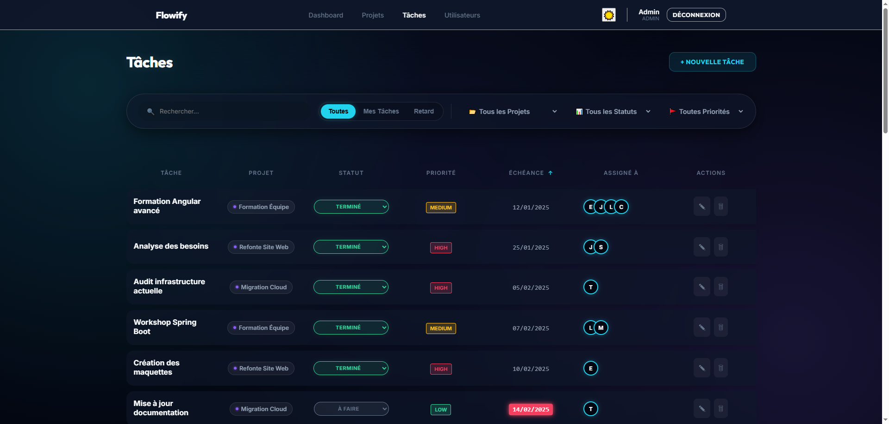
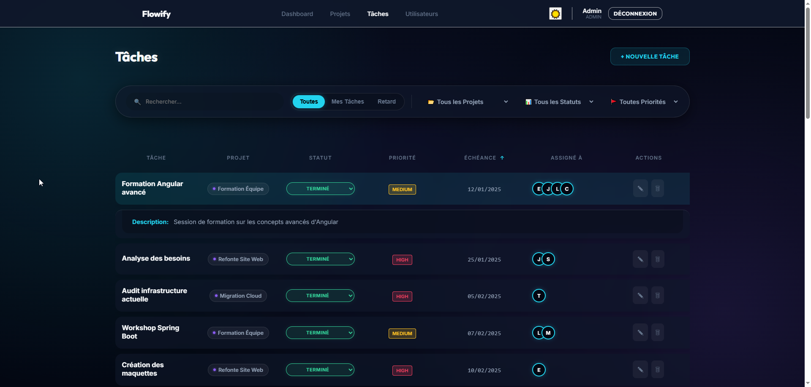

# Flowify - Task Management System (v1.0)


Un système de gestion de tâches moderne et élégant, conçu pour offrir une expérience utilisateur fluide grâce à une interface "Glassmorphism" et des fonctionnalités puissantes.


*Aperçu du Tableau de Bord*

## ✨ Nouveautés v1.0

- **Design Premium** : Interface utilisateur refondue avec le style Glassmorphism (effets de flou, translucidité).
- **Navigation Optimisée** : Barre de navigation fixe avec effet de flou pour une meilleure lisibilité.
- **Gestion Avancée des Tâches** :
  - Descriptions extensibles au clic pour garder la liste épurée.
  - Filtres dynamiques par statut, priorité et projet.
  - Assignation multi-utilisateurs.
- **Données de Démonstration** : Script de génération de données réalistes inclus.
- **Sécurité Renforcée** : Authentification JWT complète avec rôles (ADMIN/USER).

## 🚀 Fonctionnalités Clés

### 📊 Tableau de Bord
- Statistiques en temps réel.
- Vue globale de l'avancement.
- Alertes pour les tâches en retard.

### � Projets
- Création et suivi de projets.
- Archivage des anciens projets.
- Vue détaillée des tâches par projet.

### ✅ Tâches
- **Liste Intelligente** : Tri, filtrage et recherche instantanée.
- **Détails à la Demande** : Cliquez sur une tâche pour voir sa description complète.
- **Édition Rapide** : Modification de statut en un clic.
- **Assignation** : Attribuez des tâches à plusieurs collaborateurs.


*Liste des Tâches avec Description Étendue*

## 🛠️ Installation Rapide

### Prérequis
- Java 17+ & Maven
- Node.js 18+ & npm
- PostgreSQL 12+

### 1. Base de Données
Créez une base de données vide nommée `gestionnaire_taches`.

### 2. Backend (Spring Boot)
```bash
cd backend
mvn clean install
mvn spring-boot:run
```
*Le serveur démarrera sur le port 8080.*

> **Note** : Au premier lancement, utilisez le script `execute_reset.bat` (Windows) dans `src/main/resources` pour peupler la base de données avec des utilisateurs et projets de démo !

### 3. Frontend (Angular)
```bash
cd frontend
npm install
npm start
```
*L'application sera accessible sur http://localhost:4200*

## 🔑 Connexion Démo

Un jeu de données complet est fourni. Connectez-vous avec :

| Rôle | Email | Mot de passe |
|------|-------|--------------|
| **ADMIN** | `admin@gestionnaire.com` | `motdepasse` |
| **MANAGER** | `sophie.martin@gestionnaire.com` | `motdepasse` |
| **USER** | `julie.bernard@gestionnaire.com` | `motdepasse` |

## � Galerie

### Page Projets


### Détails Tâche


---
*Développé par BOULEBENE Abdelkader - Version 1.0 - 2025*
